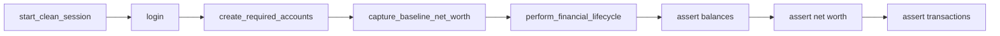

# Account lifecycle E2E test

## Goal

Build the main PDF scenario as one stable, data-driven Playwright test:

clean session → login → create accounts → financial ops → verify balances, net worth, and history.

## Design

- Tests call only [`pages/bank_app.py`](pages/bank_app.py) / page methods (strict POM).
- No hardcoded credentials or amounts in the test body — all from [`config/test_data.yaml`](config/test_data.yaml).
- `start_clean_session()` clears storage so runs are independent.
- Business assertions stay in the test; pages expose actions and getters.



### 1. Test data

In [`config/test_data.yaml`](config/test_data.yaml):

```yaml
credentials:
  username: standard_user
  password: bank_sauce

accounts:
  - name: Checking Account
    type: Checking
    opening_balance: 5000.00
  - name: Savings Account
    type: Savings
    opening_balance: 2000.00

transfer:
  from_account: Checking Account
  to_account: Savings Account
  amount: 250.00
  memo: Monthly savings transfer

send_money:
  from_account: Checking Account
  amount: 100.00
  note: Birthday gift
  # + payee fields...

bill_pay:
  from_account: Checking Account
  amount: 75.50
  memo: July utility bill
  # + biller fields...
```

Env overrides via [`utils/data_loader.py`](utils/data_loader.py) for all fields.

### 2. Money helper

In [`utils/money.py`](utils/money.py), compute expected balances from the same YAML:

- Start from opening balances
- Apply transfer (move between accounts)
- Subtract send money and bill pay from source account
- Net worth drops only by external outflows (send + bill)

### 3. Facade

On [`pages/bank_app.py`](pages/bank_app.py):

- `login(credentials)`
- `create_required_accounts(accounts)`
- `capture_baseline_net_worth()`
- `perform_financial_lifecycle(test_data)` → transfer + send + bill pay

### 4. Test

Add [`tests/test_account_lifecycle_e2e.py`](tests/test_account_lifecycle_e2e.py):

```python
@pytest.mark.e2e
class TestAccountLifecycle:
    @pytest.mark.parametrize("scenario_name", [ScenarioName.DEFAULT_ACCOUNT_LIFECYCLE])
    def test_full_account_lifecycle(self, scenario_name, bank_app, test_data):
        bank_app.start_clean_session()
        bank_app.login(test_data["credentials"])
        # assert dashboard visible
        bank_app.create_required_accounts(test_data["accounts"])
        # assert account names visible
        baseline = bank_app.capture_baseline_net_worth()
        bank_app.perform_financial_lifecycle(test_data)
        # assert balances, net worth, transaction rows
```

### 5. Verify

```bash
pytest tests/test_account_lifecycle_e2e.py -m e2e
```

Confirm balances match computed expectations and the three transaction memos/amounts appear.
