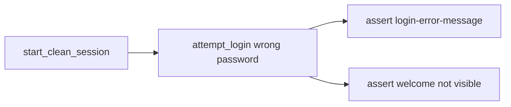

# Wrong-password negative login test

## UI behavior (verified live)

Wrong password keeps the user on `/bank/login` and shows:

- `data-testid=login-error-message` — text: `The username or password you entered is incorrect.`
- Also `login-error-banner` / `role=alert`

## Approach

Keep the lifecycle test untouched. Add a small negative test that reuses `bank_app` / `test_data`, with invalid credentials coming from YAML (not hardcoded in the test body).

### 1. Data

In [`config/test_data.yaml`](config/test_data.yaml) add:

```yaml
invalid_credentials:
  username: standard_user
  password: wrong_password
```

Optionally wire `BANK_INVALID_PASSWORD` (and username) in [`utils/data_loader.py`](utils/data_loader.py) + [`.env.example`](.env.example) for consistency with other overrides.

### 2. Login page / facade

Current [`pages/login_page.py`](pages/login_page.py) `login()` always waits for the welcome message — unusable for failure.

- Declare top-level locators: `login_error_message = page.get_by_test_id("login-error-message")`
- Split actions:
  - `submit_login(username, password)` — open, fill, click Sign In only
  - Keep `login(...)` as submit + expect welcome (happy path unchanged)
- Add thin facade on [`pages/bank_app.py`](pages/bank_app.py): e.g. `attempt_login(credentials)` calling `submit_login`, so the test still goes through the facade.

### 3. New test

Add [`tests/test_login_negative.py`](tests/test_login_negative.py) (separate from lifecycle):

```python
@pytest.mark.e2e
class TestLoginNegative:
    def test_login_with_wrong_password(self, bank_app, test_data):
        bank_app.start_clean_session()
        bank_app.attempt_login(test_data["invalid_credentials"])
        expect(bank_app.login_page.login_error_message).to_be_visible()
        expect(bank_app.login_page.welcome_heading).not_to_be_visible()
```

Assertions stay in the test; pages only perform actions / expose locators.

### 4. Verify

Run `pytest -m e2e` and confirm both the lifecycle test and the wrong-password test pass.


