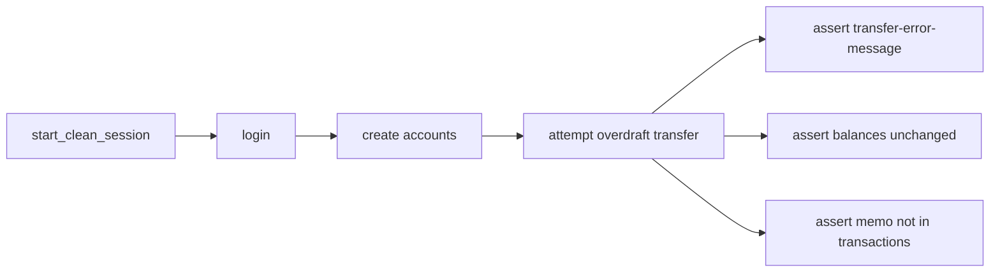

# Negative insufficient-funds transfer test

## Verified UI failure

On confirm of a transfer larger than available balance, the app:

- Shows `data-testid=transfer-error-message` with text like `Insufficient funds. Available balance: $100.00.`
- Stays on `/bank/transfer` (confirm dialog closes)
- Does **not** create a successful transfer

## Design (mirror lifecycle)

Same shape as [`tests/test_account_lifecycle_e2e.py`](tests/test_account_lifecycle_e2e.py): clean session → login → create accounts → attempt op → assert outcomes. Difference: expect **failure** and **unchanged** money state.



### 1. Test data

Add a dedicated block in [`config/test_data.yaml`](config/test_data.yaml) so the happy-path amounts stay untouched:

```yaml
insufficient_funds:
  accounts:
    - name: Checking Account
      type: Checking
      opening_balance: 100.00
    - name: Savings Account
      type: Savings
      opening_balance: 50.00
  transfer:
    from_account: Checking Account
    to_account: Savings Account
    amount: 500.00
    memo: Overdraft attempt
```

Wire optional env overrides in [`utils/data_loader.py`](utils/data_loader.py) / [`.env.example`](.env.example) for the overdraft amount and opening balances (e.g. `INSUFFICIENT_TRANSFER_AMOUNT`).

Add `ScenarioName.INSUFFICIENT_FUNDS_TRANSFER` in [`enums/account.py`](enums/account.py).

### 2. Transfer page + facade (Playwright practices)

In [`pages/transfer_page.py`](pages/transfer_page.py):

- Declare `self.transfer_error_message = page.get_by_test_id("transfer-error-message")`
- Prefer `page.get_by_test_id("confirm-transfer-btn")` for confirm (role fallbacks kept if needed)
- Split actions like login negative:
  - `_fill_transfer_form(transfer_data)` — shared fill + review click
  - `submit_transfer(transfer_data)` — fill, review, confirm; **no** success wait
  - Keep `transfer_between_accounts(...)` as submit + `wait_for_operation_feedback()` for the happy path

In [`pages/bank_app.py`](pages/bank_app.py):

- `attempt_transfer(transfer_data)` → `transfer_page.submit_transfer(...)`

Locators stay in `__init__`; methods only use declared attributes / filters.

### 3. New test file

Add [`tests/test_transfer_negative.py`](tests/test_transfer_negative.py):

```python
@pytest.mark.e2e
class TestTransferNegative:
    @pytest.mark.parametrize("scenario_name", [ScenarioName.INSUFFICIENT_FUNDS_TRANSFER])
    def test_transfer_with_insufficient_funds(self, scenario_name, bank_app, test_data):
        scenario = test_data["insufficient_funds"]

        bank_app.start_clean_session()
        bank_app.login(test_data["credentials"])
        bank_app.create_required_accounts(scenario["accounts"])

        baseline_net_worth = bank_app.capture_baseline_net_worth()
        bank_app.attempt_transfer(scenario["transfer"])

        # Failure UI
        expect(bank_app.transfer_page.transfer_error_message).to_be_visible()
        expect(bank_app.transfer_page.transfer_error_message).to_contain_text("Insufficient funds")

        # Balances unchanged (= opening balances)
        for account in scenario["accounts"]:
            actual = bank_app.accounts_page.get_account_balance(account["name"])
            assert actual == float(account["opening_balance"])

        # Net worth unchanged
        bank_app.dashboard_page.open()
        assert bank_app.dashboard_page.get_total_net_worth() == baseline_net_worth

        # Failed transfer must not appear in history
        bank_app.transactions_page.open_transactions()
        expect(
            bank_app.transactions_page.transaction_row(scenario["transfer"]["memo"])
        ).not_to_be_visible()
```

Assertions remain in the test; pages/facade only perform actions.

### 4. Verify

Run `pytest -m e2e` and confirm all three pass: lifecycle, wrong-password login, insufficient-funds transfer.
